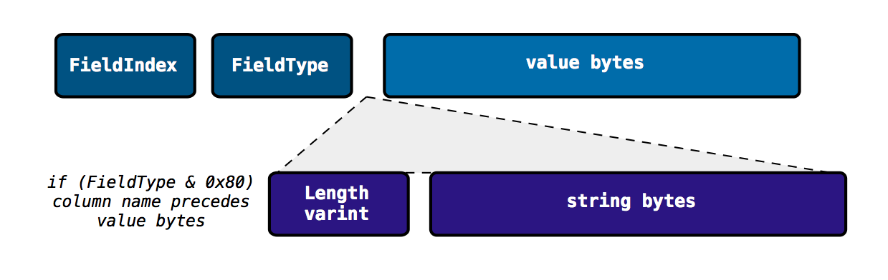
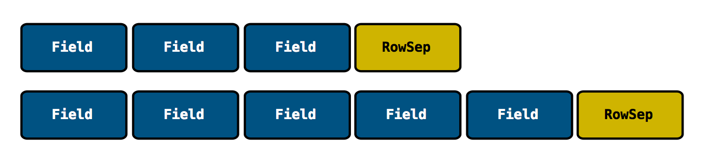

## Crow : A C++ library for encoding and decoding typed rows

Think of this as a binary CSV.  This library is for encoding and decoding native C types in a compact protobuf-like format.  It's best suited for serializing typed tabular data, where the columns are not known at compile time.

### Why not use protobuf?
One of the challenges with libprotobuf, is the need to compile definitions.  Part of this
is due to the encoding of WireFormat (varint,length-delimited,etc) rather than FieldType
(uint32, int64,double,string).

### Format Summary

Only support primitive and string types.  Each field has a two-byte tag:
 - Zero-based field index
 - FieldType

If the FieldType byte has 0x80 set, then the column name precedes the value bytes.
Strings consist of a length varint followed by the string bytes.
All int-based fields are varint.  Double fields are stored as fixed64.



Each "row" of the tabular data should be demarcated using a RowSep tag.



### Encoding example

```
struct A {
  int32_t     i32val;
  uint64_t    u64val;
  std::string strval;
};

A a = { 45, 0x0FFFFFFFFFFFF, "hello"};
auto pEnc = simplepb::EncoderNew();
uint32_t fieldIndex = 0;
pEnc->put(fieldIndex++, a.i32val);
pEnc->put(fieldIndex++, a.i64val);
pEnc->put(fieldIndex++, a.strval);
const std::vector<uint8_t>& result = pEnc->buffer();

```

### Decoding example

```
auto listener = MyDecoderListener();
auto pDec = simplepb::DecoderNew();
pDec->decode(byteVec, listener);
```

where MyDecoderListener is implemented by your application.
Here is an example that just collects strings:

```
class MyDecoderListener : public DecoderListener {
public:
  void onField(uint32_t fieldIndex, std::string value, std::string optionalColumnName) override {
    strings.push_back(value);
  }
  std::vector<std::string> strings;
};
```
### Included work

- A simplified version of [rapidjson/internal/stack.h](https://github.com/Tencent/rapidjson/blob/master/include/rapidjson/internal/stack.h) is used as the internal buffer.

- Makes use of [libprotobuf encoding](https://developers.google.com/protocol-buffers/docs/encoding) methodology (Base 128 Varint, ZigZag transform, tags, length-delimited strings)
